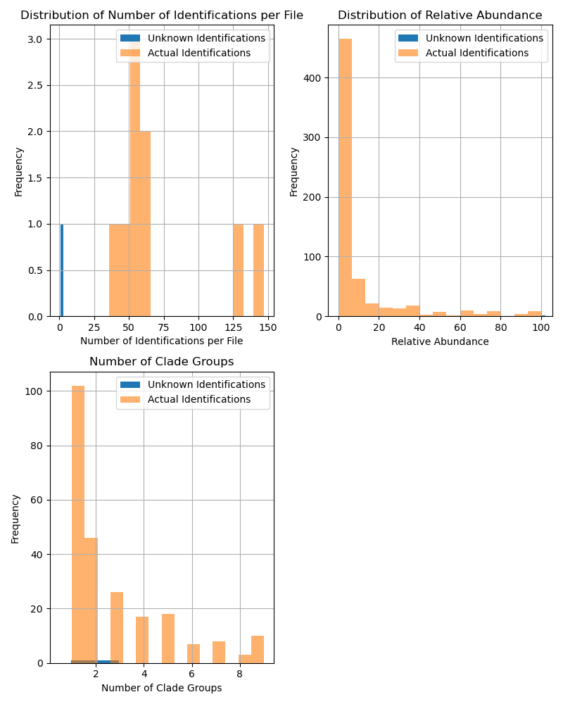
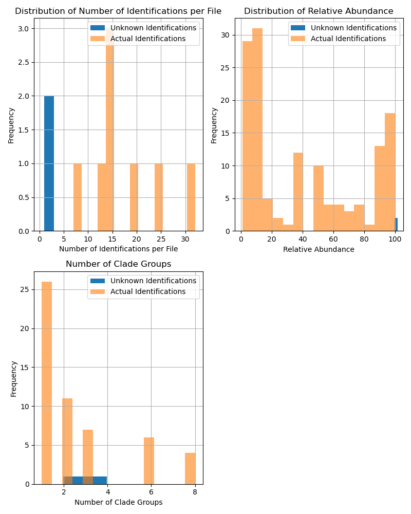
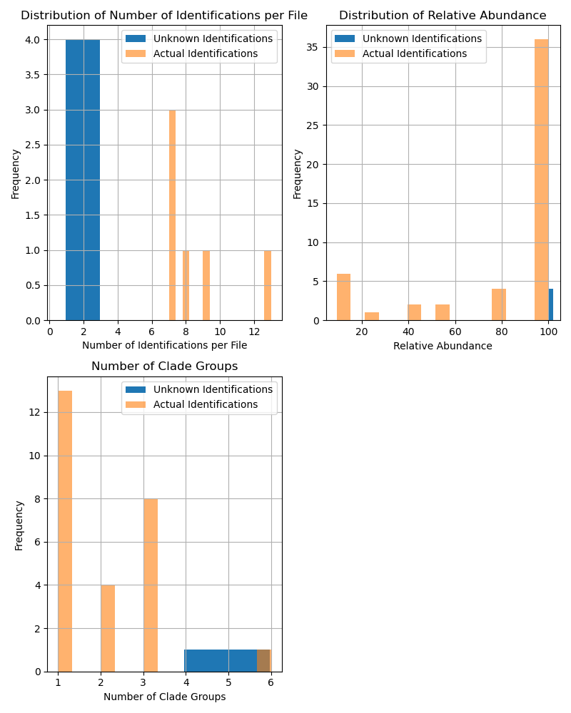
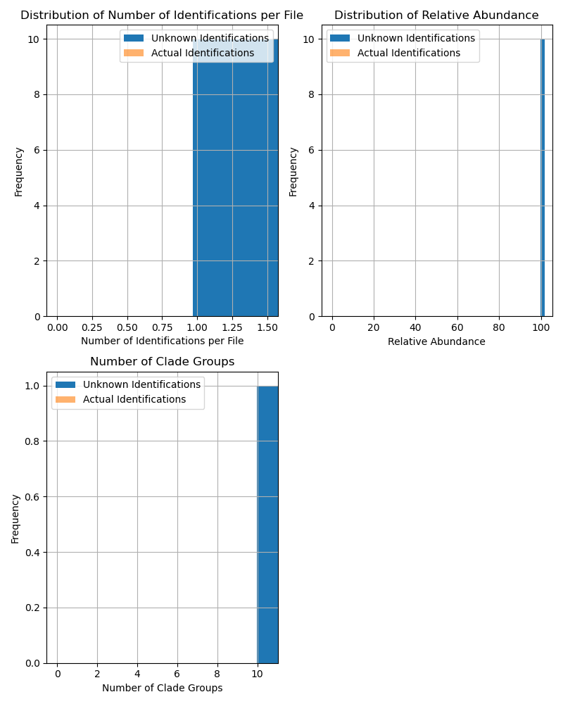
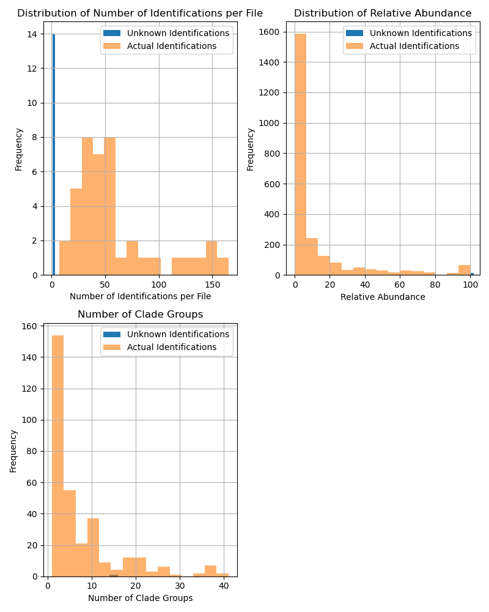

# Sanity Check Pipeline

We wanted to run a sanity check on the pipeline to test it on the full raw data using 10 random raw fastq files. We also ran a 5M and 2M subsampled read experiments on the same 10 fastq files.

Based on the results on the raw data (10 fastq files), we are only identifying ~55 clade groups per fastq file, which doesn't seem right, I would think we should be able to identify a lot more things given the full read depth. With the 56 fastq files, we're still only identifying ~50 clade groups per fastq file. The original preprocessed data from the publication has ~105 nonzero features per sample.

## Random 10 fastq files used

Files were randomly chosen using:
```
find ./SRA/ -type f -name "*.fastq.tar.gz" -print0 | xargs -0 shuf -e -n 10 -z | xargs -0 cp -vt ./sanity_check/
```

```
(microbiome) root@97b0edf71e22:/project/workflow# lh ../data/raw/sanity_check
total 42G
-rw-r--r-- 1 root root 5.2G May 19 22:14 ERR2017534.fastq.tar.gz
-rw-r--r-- 1 root root 4.7G May 19 22:15 ERR2017706.fastq.tar.gz
-rw-r--r-- 1 root root 4.2G May 19 22:16 ERR2017705.fastq.tar.gz
-rw-r--r-- 1 root root 3.1G May 19 22:16 ERR2017617.fastq.tar.gz
-rw-r--r-- 1 root root 4.7G May 19 22:16 ERR2017540.fastq.tar.gz
-rw-r--r-- 1 root root 4.6G May 19 22:17 ERR2017712.fastq.tar.gz
-rw-r--r-- 1 root root 5.0G May 19 22:17 ERR2017547.fastq.tar.gz
-rw-r--r-- 1 root root 2.6G May 19 22:18 ERR2017804.fastq.tar.gz
-rw-r--r-- 1 root root 5.2G May 19 22:19 ERR2017622.fastq.tar.gz
-rw-r--r-- 1 root root 2.6G May 19 22:19 ERR2017412.fastq.tar.gz
```

## Full Raw Data

- Kneadded raw fastq files with keaddata
- Processed kneadded data with metaphlan



## 5M Subsampled Data

- Subsampled 5M reads using seqtk
- Kneadded subsampled fastq files with keaddata
- Processed kneadded data with metaphlan



## 2M Subsampled Data

- Subsampled 2M reads using seqtk
- Kneadded subsampled fastq files with keaddata
- Processed kneadded data with metaphlan



## Full Raw Data with no Kneadding

- Processed the raw data straight through metaphlan without kneaddata.



## Full Raw Data on 56 fastq files

I wanted to test the number of identification/features using a larger randomly sampled set of fastq files, because based on the 10 fastq files, the numbers didn't seem as comparable to the preprocessed data from the Gupta results. See[../../results/notebooks/Feature_Counts_ACVD_v_Rest_Jie.ipynb](../../results/notebooks/Feature_Counts_ACVD_v_Rest_Jie.ipynb)

### Random Files Sampled for Experiment
```
(microbiome) root@97b0edf71e22:/project/workflow# lh ../data/raw/sanity_check
total 208G
-rw-r--r-- 1 root root 4.2G May 19 22:16 ERR2017705.fastq.tar.gz
-rw-r--r-- 1 root root 4.7G May 19 22:16 ERR2017540.fastq.tar.gz
-rw-r--r-- 1 root root 4.6G May 19 22:17 ERR2017712.fastq.tar.gz
-rw-r--r-- 1 root root 5.0G May 19 22:17 ERR2017547.fastq.tar.gz
-rw-r--r-- 1 root root 5.2G May 19 22:19 ERR2017622.fastq.tar.gz
-rw-r--r-- 1 root root 2.6G May 19 22:19 ERR2017412.fastq.tar.gz
-rw-r--r-- 1 root root 4.6G May 21 06:05 ERR2017539.fastq.tar.gz
-rw-r--r-- 1 root root 2.6G May 21 06:06 ERR2017804.fastq.tar.gz
-rw-r--r-- 1 root root 3.1G May 21 06:07 ERR2017617.fastq.tar.gz
-rw-r--r-- 1 root root 3.2G May 21 06:08 ERR2017764.fastq.tar.gz
-rw-r--r-- 1 root root 2.9G May 21 06:08 ERR2017802.fastq.tar.gz
-rw-r--r-- 1 root root 3.8G May 21 06:08 ERR2017675.fastq.tar.gz
-rw-r--r-- 1 root root 4.8G May 21 06:09 ERR2017590.fastq.tar.gz
-rw-r--r-- 1 root root 2.4G May 21 06:09 ERR2017779.fastq.tar.gz
-rw-r--r-- 1 root root 5.3G May 21 06:10 ERR2017714.fastq.tar.gz
-rw-r--r-- 1 root root 2.5G May 21 06:10 ERR2017761.fastq.tar.gz
-rw-r--r-- 1 root root 4.2G May 21 06:11 ERR2017699.fastq.tar.gz
-rw-r--r-- 1 root root 3.1G May 21 06:11 ERR2017755.fastq.tar.gz
-rw-r--r-- 1 root root 5.9G May 21 06:12 ERR2017528.fastq.tar.gz
-rw-r--r-- 1 root root 2.6G May 21 06:12 ERR2017517.fastq.tar.gz
-rw-r--r-- 1 root root 6.0G May 21 06:13 ERR2017462.fastq.tar.gz
-rw-r--r-- 1 root root 3.4G May 21 06:14 ERR2017423.fastq.tar.gz
-rw-r--r-- 1 root root 5.5G May 21 06:15 ERR2017659.fastq.tar.gz
-rw-r--r-- 1 root root 2.8G May 21 06:15 ERR2017644.fastq.tar.gz
-rw-r--r-- 1 root root 4.0G May 21 06:16 ERR2017726.fastq.tar.gz
-rw-r--r-- 1 root root 3.0G May 21 06:17 ERR2017647.fastq.tar.gz
-rw-r--r-- 1 root root 4.2G May 21 06:17 ERR2017614.fastq.tar.gz
-rw-r--r-- 1 root root 4.7G May 21 06:18 ERR2017594.fastq.tar.gz
-rw-r--r-- 1 root root 3.4G May 21 06:19 ERR2017638.fastq.tar.gz
-rw-r--r-- 1 root root 3.6G May 21 06:20 ERR2017650.fastq.tar.gz
-rw-r--r-- 1 root root 4.3G May 21 06:20 ERR2017623.fastq.tar.gz
-rw-r--r-- 1 root root 2.4G May 21 06:21 ERR2017453.fastq.tar.gz
-rw-r--r-- 1 root root 4.5G May 21 06:22 ERR2017697.fastq.tar.gz
-rw-r--r-- 1 root root 3.2G May 21 06:22 ERR2017439.fastq.tar.gz
-rw-r--r-- 1 root root 3.5G May 21 06:23 ERR2017458.fastq.tar.gz
-rw-r--r-- 1 root root 4.7G May 21 06:24 ERR2017706.fastq.tar.gz
-rw-r--r-- 1 root root 2.9G May 21 06:26 ERR2017490.fastq.tar.gz
-rw-r--r-- 1 root root 4.3G May 21 06:26 ERR2017661.fastq.tar.gz
-rw-r--r-- 1 root root 5.1G May 21 06:27 ERR2017536.fastq.tar.gz
-rw-r--r-- 1 root root 5.5G May 21 06:28 ERR2017660.fastq.tar.gz
-rw-r--r-- 1 root root 5.2G May 21 06:29 ERR2017534.fastq.tar.gz
-rw-r--r-- 1 root root 4.4G May 21 06:31 ERR2017735.fastq.tar.gz
-rw-r--r-- 1 root root 2.6G May 21 06:31 ERR2017775.fastq.tar.gz
-rw-r--r-- 1 root root 5.1G May 21 06:32 ERR2017543.fastq.tar.gz
-rw-r--r-- 1 root root 3.3G May 21 06:32 ERR2017475.fastq.tar.gz
-rw-r--r-- 1 root root 3.3G May 21 06:33 ERR2017763.fastq.tar.gz
-rw-r--r-- 1 root root 3.0G May 21 06:34 ERR2017427.fastq.tar.gz
-rw-r--r-- 1 root root 3.3G May 21 06:34 ERR2017415.fastq.tar.gz
-rw-r--r-- 1 root root 3.1G May 21 06:35 ERR2017801.fastq.tar.gz
-rw-r--r-- 1 root root 2.8G May 21 06:36 ERR2017765.fastq.tar.gz
-rw-r--r-- 1 root root 2.8G May 21 06:36 ERR2017482.fastq.tar.gz
-rw-r--r-- 1 root root 2.9G May 21 06:37 ERR2017740.fastq.tar.gz
-rw-r--r-- 1 root root 2.1G May 21 06:37 ERR2017506.fastq.tar.gz
-rw-r--r-- 1 root root 3.7G May 21 06:38 ERR2017455.fastq.tar.gz
-rw-r--r-- 1 root root 4.4G May 21 06:39 ERR2017813.fastq.tar.gz
```

- Kneadded raw fastq files with keaddata
- Processed kneadded data with metaphlan

